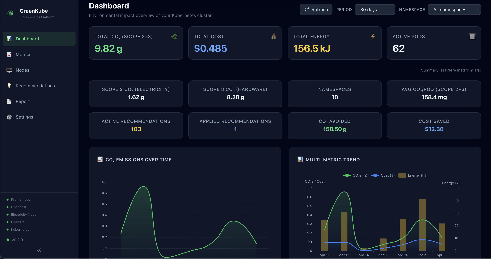
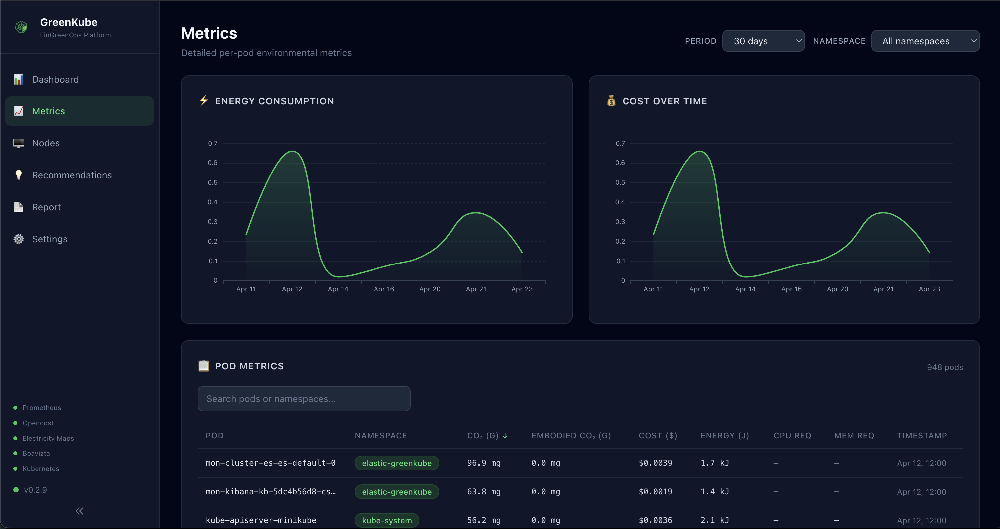
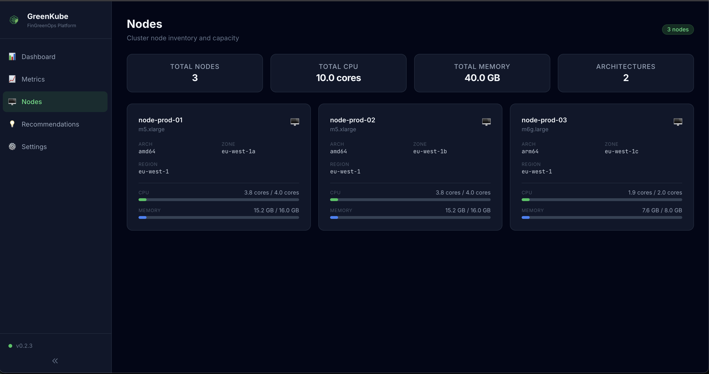
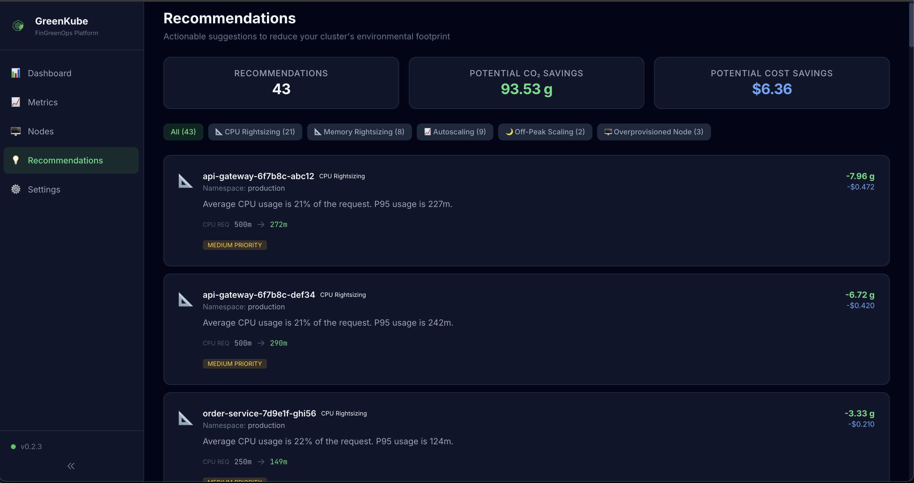

#  **GreenKube**

**Measure, understand, and reduce the carbon footprint of your Kubernetes infrastructure. Make your cloud operations both cost-effective and environmentally responsible.**

GreenKube is an open-source tool designed to help DevOps, SRE, and FinOps teams get clear **carbon visibility** and **cost control** over their Kubernetes infrastructure — without complex setup or expensive SaaS tools.

[](https://opensource.org/licenses/Apache-2.0)
[](https://github.com/GreenKubeCloud/greenkube/stargazers)
[](https://hub.docker.com/r/greenkube/greenkube)
[](CHANGELOG.md)

> **🌐 Live demo:** [demo.greenkube.cloud](https://demo.greenkube.cloud) — explore the dashboard with realistic sample data, no install required.


## 🎯 Mission

Cloud computing generates significant carbon emissions, yet most engineering teams have no visibility into the footprint of their Kubernetes workloads. GreenKube addresses this by providing tools to:

1.  **Estimate** the energy consumption and CO₂e emissions of each Kubernetes workload.
2.  **Visualize** these metrics in a real-time dashboard for actionable carbon visibility.
3.  **Optimize** infrastructure to simultaneously reduce cloud bills and environmental impact.

## ✨ Features (Version 0.2.3)

### 📊 Dashboard & Visualization
* **Modern Web Dashboard:** Built-in SvelteKit SPA with real-time charts (ECharts), interactive per-pod metrics table, node inventory, and optimization recommendations — all served from the same container as the API.
* **REST API:** Full-featured FastAPI backend with comprehensive endpoints for metrics, nodes, namespaces, recommendations, timeseries, and configuration. OpenAPI docs included at `/api/v1/docs`.

### 📈 Comprehensive Resource Monitoring
* **Multi-Resource Metrics Collection:** GreenKube collects the following metrics per pod:
  - **CPU usage** (actual utilization in millicores)
  - **Memory usage** (bytes consumed)
  - **Network I/O** (bytes received/transmitted)
  - **Disk I/O** (bytes read/written)
  - **Storage** (ephemeral storage requests and usage)
  - **Pod restarts** (restart count per container)
* **Energy Estimation:** Calculates pod-level energy consumption (Joules) based on **CPU usage** and a built-in library of cloud instance power profiles. Memory, network, disk, and GPU are collected as metrics but are **not yet included in the energy model** — this is planned for a future release.
* **Carbon Footprint Tracking:** Converts energy to CO₂e emissions using real-time or default grid carbon intensity data. GPU workloads are currently **not supported** in the carbon model.

### 🎯 Optimization & Reporting
* **9-Type Recommendation Engine:** Identifies optimization opportunities:
  - **Zombie pods** (idle but costly workloads)
  - **CPU rightsizing** (over-provisioned CPU requests)
  - **Memory rightsizing** (over-provisioned memory requests)
  - **Autoscaling candidates** (high usage variability)
  - **Off-peak scheduling** (idle during off-peak hours)
  - **Idle namespace cleanup** (namespaces with minimal activity)
  - **Carbon-aware scheduling** (shift to lower-carbon zones/times)
  - **Overprovisioned nodes** / **Underutilized nodes**
* **Pod & Namespace Reporting:** Detailed reports of CO₂e emissions, energy usage, and costs per pod and namespace.
* **Historical Analysis:** Report on any time period (`--last 7d`, `--last 3m`) with flexible grouping (`--daily`, `--monthly`, `--yearly`).
* **Data Export:** Export reports to CSV or JSON for integration with other tools and BI systems.

### 🔧 Infrastructure & Deployment
* **Demo Mode:** Deploy a standalone demo pod with `kubectl run` to explore GreenKube with realistic sample data—no live cluster metrics needed.
* **Grafana Dashboard:** Pre-built JSON dashboard with CO₂e, cost, energy, resource, and recommendation panels — import in one click.
* **Prometheus Integration:** ServiceMonitor and NetworkPolicy for automatic scraping by kube-prometheus-stack.
* **Database Migration System:** Automated, versioned schema migrations for PostgreSQL and SQLite.
* **Flexible Data Backends:** Supports PostgreSQL (default/recommended), SQLite (local/dev), and Elasticsearch (production scale) for storing metrics and carbon intensity data.
* **Service Auto-Discovery:** Automatically discovers in-cluster Prometheus and OpenCost services to simplify setup (manually configurable via Helm values).
* **Helm Chart Deployment:** Production-ready Helm chart with PostgreSQL StatefulSet, configurable persistence, RBAC, and health probes.
* **Cloud Provider Support:** Built-in profiles for AWS, GCP, Azure, OVH, and Scaleway with automatic region-to-carbon-zone mapping.
* **On-Premises Support:** Manual zone labeling for bare-metal clusters without cloud provider metadata.


## 📦 Dependencies

The chart requires the following services to be available in the cluster:

- **OpenCost** – for cost data.
- **Prometheus** – for metrics collection.

GreenKube uses service auto‑discovery to locate these services automatically. If they are deployed in non‑standard namespaces or with custom names, auto‑discovery may fail. In that case, set the service URLs manually in `values.yaml` (see the `prometheus.url` and `opencost.url` fields).

## 🚀 Installation & Usage

The recommended way to install GreenKube is via the official Helm chart.

### 1. Install

```bash
helm repo add greenkube https://GreenKubeCloud.github.io/GreenKube
helm repo update
helm install greenkube greenkube/greenkube \
  -n greenkube \
  --create-namespace
```

#### 🎮 Get a quick insight with demo mode

Explore GreenKube with realistic sample data in under 30 seconds — no Prometheus or OpenCost required:

**With Docker (no Kubernetes needed):**

```bash
docker run --rm -p 9000:9000 greenkube/greenkube:0.2.3 demo --no-browser --port 9000
# → Open http://localhost:9000
```

**With kubectl:**

```bash
kubectl run greenkube-demo \
  --image=greenkube/greenkube:0.2.3 \
  --restart=Never \
  --command -- greenkube demo --no-browser --port 9000

kubectl wait --for=condition=Ready pod/greenkube-demo --timeout=60s
kubectl port-forward pod/greenkube-demo 9000:9000
# → Open http://localhost:9000
```

The demo loads **7 days** of metrics for 22 pods across 5 namespaces (production, staging, monitoring, data-pipeline, ci-cd) with carbon emissions, costs, and optimization recommendations pre-populated.

```bash
kubectl delete pod greenkube-demo  # clean up when done (kubectl only)
```

This deploys GreenKube with the collector, API server, web dashboard, and PostgreSQL — all in a single command.

## 📸 Screenshots

| Dashboard | Metrics |
|-----------|---------|
|  |  |

| Nodes | Recommendations |
|-------|----------------|
|  |  |

### 2. Access the Dashboard

```bash
kubectl port-forward svc/greenkube-api 8000:8000 -n greenkube
# → Open http://localhost:8000
```

### 3. (Optional) Add Secrets & Custom Configuration

GreenKube works out of the box, but you have to customize your deployment to have as accurate data as possible. To do so, create a `my-values.yaml`:

```yaml
secrets:
  # (Optional) Electricity Maps API token — for real-time grid carbon intensity.
  # Get a free token at https://www.electricitymaps.com/
  # Without a token, GreenKube uses a default of 500 gCO₂e/kWh.
  electricityMapsToken: "YOUR_TOKEN_HERE"

# Uncomment to manually set your Prometheus URL
# (If left empty, GreenKube will try to auto-discover it)
# config:
#   prometheus:
#     url: "http://prometheus-k8s.monitoring.svc.cluster.local:9090"
```

Then apply it:

```bash
helm upgrade greenkube greenkube/greenkube \
  -f my-values.yaml \
  -n greenkube
```

#### On-Premises / Bare-Metal Clusters

Cloud providers automatically expose zone labels on nodes (e.g., `topology.kubernetes.io/zone`). On-premises clusters do not have these labels, so GreenKube cannot determine the electrical grid zone. You must configure the zone manually:

```bash
# 1. Label your nodes with their geographic zone (ISO 3166 country code)
#    This tells GreenKube which electrical grid to use for carbon intensity.
#    Common zones: FR (France), DE (Germany), US-CAL-CISO (California), GB (UK)
#    Full list: https://app.electricitymaps.com/map
kubectl label nodes --all topology.kubernetes.io/zone=FR

# 2. Set the cloud provider to "on-prem" and the default zone in your values
cat <<EOF >> my-values.yaml
config:
  cloudProvider: on-prem
  defaultZone: FR
EOF
```

> **Tip:** If your cluster spans multiple locations, label each node individually with the correct zone (e.g., `FR` for Paris, `DE` for Frankfurt).

## 🖥️ Web Dashboard

GreenKube ships with a built-in web dashboard (SvelteKit SPA served by the API). Once deployed, access it via port-forward:

```bash
kubectl port-forward svc/greenkube-api 8000:8000 -n greenkube
```

Then open [http://localhost:8000](http://localhost:8000) in your browser.

The dashboard includes:
- **Dashboard** — KPI cards (CO₂, cost, energy, pods), time-series charts (ECharts), namespace breakdown pie chart, and top pods by emissions/cost
- **Metrics** — Interactive table with sortable and searchable per-pod metrics including energy, cost, and all resource consumption data (CPU, memory, network, disk, storage)
- **Nodes** — Cluster node inventory with CPU/memory capacity bars, hardware profiles, cloud provider info, and carbon zones
- **Recommendations** — Actionable optimization suggestions (zombie pods, rightsizing opportunities) with estimated savings in cost and CO₂e
- **Settings** — Current configuration, API health status, version info, and database connection details

### 🎨 Dashboard Features
- **Auto-refresh** with configurable polling interval
- **Responsive design** works on desktop and mobile
- **Dark/light theme** support
- **Export capabilities** for charts and data tables
- **Advanced filtering** by namespace, time range, and resource type

## Prometheus & Grafana Integration

GreenKube exposes Prometheus metrics at `/prometheus/metrics` and ships with a pre-built Grafana dashboard.

### Prometheus Scraping

If you use the **kube-prometheus-stack** (Prometheus Operator), the Helm chart automatically creates a `ServiceMonitor` and a `NetworkPolicy`:

```yaml
# In your my-values.yaml
monitoring:
  serviceMonitor:
    enabled: true            # Creates a ServiceMonitor resource
    namespace: monitoring    # Must match your Prometheus serviceMonitorNamespaceSelector
    interval: 30s
  networkPolicy:
    enabled: true            # Allows Prometheus to reach the GreenKube API port
    prometheusNamespace: monitoring
```

GreenKube metrics include:
- `greenkube_co2e_grams` — CO₂e emissions per pod
- `greenkube_energy_joules` — Energy consumption per pod
- `greenkube_cost_total` — Cost per pod
- `greenkube_cpu_usage_millicores`, `greenkube_memory_usage_bytes` — Resource usage
- `greenkube_network_receive_bytes`, `greenkube_network_transmit_bytes` — Network I/O
- `greenkube_grid_intensity` — Grid carbon intensity per zone
- `greenkube_recommendation_total` — Recommendation counts by type
- `greenkube_node_info` — Node metadata (instance type, zone, capacity)

**Manual Prometheus config** (if not using the Operator):

```yaml
# Add to your prometheus.yml
scrape_configs:
  - job_name: 'greenkube'
    scrape_interval: 30s
    metrics_path: /prometheus/metrics
    static_configs:
      - targets: ['greenkube-api.greenkube.svc.cluster.local:8000']
```

### Grafana Dashboard

Import the pre-built dashboard from `dashboards/greenkube-grafana.json`:

1. In Grafana, go to **Dashboards → Import**
2. Upload `dashboards/greenkube-grafana.json` (or paste the JSON)
3. Select your Prometheus data source
4. Click **Import**

The dashboard includes:
- **KPI row:** Total CO₂e, total cost, total energy, active pods, active nodes
- **Time-series:** CO₂e over time, cost over time, energy over time
- **Namespace breakdown:** Pie charts for CO₂e and cost by namespace
- **Top pods:** Bar charts for heaviest emitters and most expensive pods
- **Node utilization:** CPU and memory usage per node
- **Grid intensity:** Carbon intensity over time per zone
- **Recommendations:** Summary table of optimization suggestions

## 🔌 API Reference

The API is available at `/api/v1` and serves both JSON endpoints and the web dashboard.

| Endpoint | Description |
|---|---|
| `GET /api/v1/health` | Health check and version |
| `GET /api/v1/version` | Application version |
| `GET /api/v1/config` | Current configuration |
| `GET /api/v1/metrics?namespace=&last=24h` | Per-pod metrics |
| `GET /api/v1/metrics/summary?namespace=&last=24h` | Aggregated summary |
| `GET /api/v1/metrics/timeseries?granularity=day&last=7d` | Time-series data |
| `GET /api/v1/namespaces` | List of active namespaces |
| `GET /api/v1/nodes` | Cluster node inventory |
| `GET /api/v1/recommendations?namespace=` | Optimization recommendations |

Interactive API docs are available at `/api/v1/docs` (Swagger UI).

### API Examples

```bash
# Get a health check
curl http://localhost:8000/api/v1/health
# {"status":"ok","version":"0.2.3"}

# Get metrics for the last 24 hours
curl "http://localhost:8000/api/v1/metrics?last=24h"

# Get metrics summary for a specific namespace
curl "http://localhost:8000/api/v1/metrics/summary?namespace=default&last=7d"
# {"total_co2e_grams":142.5,"total_embodied_co2e_grams":12.3,"total_cost":0.87,...}

# Get hourly timeseries data for the last 7 days
curl "http://localhost:8000/api/v1/metrics/timeseries?granularity=hour&last=7d"

# Get optimization recommendations
curl "http://localhost:8000/api/v1/recommendations?namespace=production"
```

## 📈 Running Reports & Getting Recommendations

The primary way to interact with GreenKube is by using `kubectl exec` to run commands inside the running pod.

### 1. Find your GreenKube pod:

```bash
kubectl get pods -n greenkube
```

(Look for a pod named something like greenkube-7b5...)

### 2. Run an on-demand report:

```bash
# Replace <pod-name> with the name from the previous step
kubectl exec -it <pod-name> -n greenkube -- bash
```

### 3. Run a report:

```bash
greenkube report --daily
```
See the doc or `greenkube report --help` to see more options.

### 4. Get optimization recommendations:

```bash
greenkube recommend
```

## 🏗️ Architecture Summary

GreenKube follows a clean, hexagonal architecture with strict separation between core business logic and infrastructure adapters.

### Core Components

**Collectors** (Input Adapters):
- **PrometheusCollector:** Fetches CPU, memory, network I/O, disk I/O, and restart count metrics via PromQL queries
- **NodeCollector:** Gathers node metadata (zones, instance types, capacity) from Kubernetes API
- **PodCollector:** Collects resource requests (CPU, memory, ephemeral storage) from pod specs
- **OpenCostCollector:** Retrieves cost allocation data for financial reporting
- **ElectricityMapsCollector:** Fetches real-time carbon intensity data by geographic zone
- **BoaviztaCollector:** Fetches hardware embodied emissions from Boavizta API

**Processing Pipeline** (DataProcessor delegates to focused collaborators):
- **CollectionOrchestrator:** Runs all collectors in parallel via `asyncio.gather`
- **BasicEstimator:** Converts CPU usage into energy consumption (Joules) using cloud instance power profiles
- **NodeZoneMapper:** Maps cloud provider zones to Electricity Maps carbon zones
- **PrometheusResourceMapper:** Builds per-pod resource maps (CPU, memory, network, disk, restarts) from Prometheus data
- **CostNormalizer:** Divides OpenCost daily/range totals into per-step values
- **MetricAssembler:** Combines energy, cost, resources, and metadata into unified `CombinedMetric` objects
- **HistoricalRangeProcessor:** Processes time ranges in day-sized chunks for memory efficiency
- **EmbodiedEmissionsService:** Fetches, caches, and calculates Boavizta embodied emissions per pod
- **CarbonCalculator:** Converts energy (Joules → kWh) to CO₂e using grid intensity and PUE

**Business Logic:**
- **Recommender:** Analyzes CombinedMetric data with 9 analyzer types:
  - Zombie detection, CPU/memory rightsizing, autoscaling candidates
  - Off-peak scheduling, idle namespace cleanup, carbon-aware scheduling
  - Overprovisioned/underutilized node detection

**Storage** (Output Adapters):
- **Repositories:** Abstract interfaces implemented for multiple backends:
  - **PostgresRepository:** Production-grade persistent storage (asyncpg driver)
  - **SQLiteRepository:** Local development and testing (aiosqlite driver)
  - **ElasticsearchRepository:** High-scale time-series storage and analytics
- **NodeRepository:** Historical node state snapshots for accurate time-range reporting
- **EmbodiedRepository:** Boavizta API integration for hardware embodied emissions

**API & Presentation:**
- **FastAPI Server:** REST API with OpenAPI documentation, CORS support, health checks, Prometheus metrics endpoint
- **SvelteKit Dashboard:** Modern SPA with ECharts visualizations and Tailwind CSS
- **Grafana Dashboard:** Pre-built FinGreenOps dashboard via Prometheus integration

### Data Flow

1. **Collection Phase** (async/concurrent):
   ```
   Prometheus → CPU, memory, network, disk metrics
   Kubernetes → Node metadata, pod resource requests
   OpenCost → Cost allocation data
   ```

2. **Processing Phase**:
   ```
   Raw metrics → Energy estimation (Joules per pod)
   Node metadata → Cloud zone mapping
   Historical data → Node state reconstruction
   ```

3. **Calculation Phase**:
   ```
   Energy + Grid intensity + PUE → CO₂e emissions
   Metrics + Cost data → Combined metrics
   ```

4. **Analysis Phase**:
   ```
   Combined metrics → Recommendations engine
   Time-series data → Trend analysis
   ```

5. **Storage & Presentation**:
   ```
   Combined metrics → Database (Postgres/SQLite/ES)
   Database → API → Web Dashboard
   API → CLI reports/exports
   ```

### Key Design Principles

- **Async-First:** Fully leverages Python `asyncio` for non-blocking I/O operations
- **Database Agnostic:** Repository pattern abstracts storage implementation
- **Cloud Agnostic:** Supports AWS, GCP, Azure, OVH, Scaleway with extensible mapping
- **Resilient:** Graceful degradation when data sources are unavailable
- **Transparent:** Clear flagging of estimated vs. measured values with reasoning
- **Modular:** Each component is independently testable and replaceable
- **Observable:** Comprehensive logging at all pipeline stages


## 🔬 How Energy & CO₂e Estimation Works

GreenKube's estimation pipeline converts raw Kubernetes metrics into actionable carbon data in four steps:

1. **Collect CPU usage** — Prometheus provides per-pod CPU utilisation in millicores over each collection interval.
2. **Map to power** — Each node's instance type is matched to a power profile (min/max watts per vCPU) derived from [SPECpower](https://www.spec.org/power_ssj2008/) benchmarks and the [Cloud Carbon Footprint](https://www.cloudcarbonfootprint.org/) coefficient database. The power draw is linearly interpolated between min watts (idle) and max watts (100 % utilisation).
3. **Apply PUE** — The estimated power is multiplied by the Power Usage Effectiveness factor for the cloud provider's data centre (e.g. 1.135 for AWS, 1.10 for GCP).
4. **Convert to CO₂e** — Energy (kWh) is multiplied by the grid carbon intensity of the node's geographic zone. When available, real-time intensity is fetched from the [Electricity Maps API](https://www.electricitymaps.com/); otherwise a configurable default is used.

> **Embodied emissions** are estimated separately via the [Boavizta API](https://doc.api.boavizta.org/), which models the manufacturing footprint of cloud instances amortised over their expected lifespan.

For provider-specific coefficients and the full derivation, see [`docs/power_estimation_methodology.md`](docs/power_estimation_methodology.md).


## 📋 Changelog

See [`CHANGELOG.md`](CHANGELOG.md) for a full version history and the [GitHub Releases](https://github.com/GreenKubeCloud/GreenKube/releases) page for published releases.


## 🤝 Contributing
GreenKube is a community-driven project, and we welcome all contributions! Check out our [CONTRIBUTING.md](CONTRIBUTING.md) file to learn how to get involved.

### Development Setup

```bash
# Clone and install
git clone https://github.com/GreenKubeCloud/GreenKube.git
cd GreenKube
python -m venv .venv
source .venv/bin/activate
pip install -e ".[dev,test]"
pre-commit install

# Run the tests
pytest

# Start the API locally (uses SQLite by default)
DB_TYPE=sqlite greenkube-api

# Run the frontend
cd frontend && npm install && npm run dev
```

* **Report Bugs**: Open an [Issue](https://github.com/GreenKubeCloud/GreenKube/issues) with a detailed description.

* **Suggest Features**: Let's discuss them in the GitHub [Discussions](https://github.com/GreenKubeCloud/GreenKube/discussions).

* **Submit Code**: Make a Pull Request!


## 📄 Licence

This project is licensed under the `Apache 2.0 License`. See the `LICENSE` file for more details.