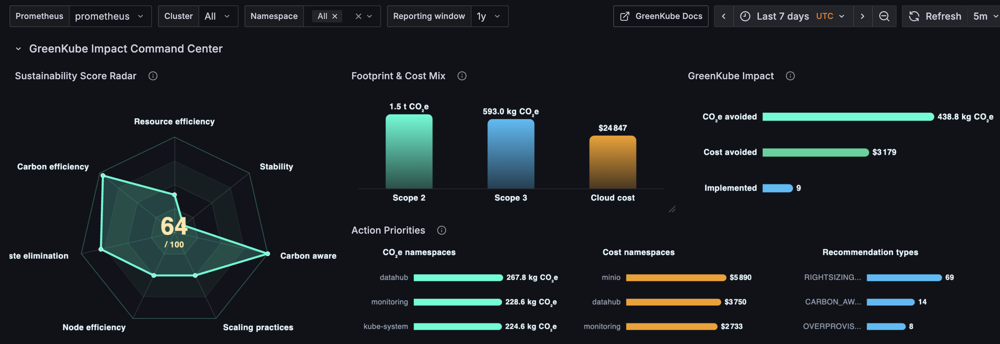
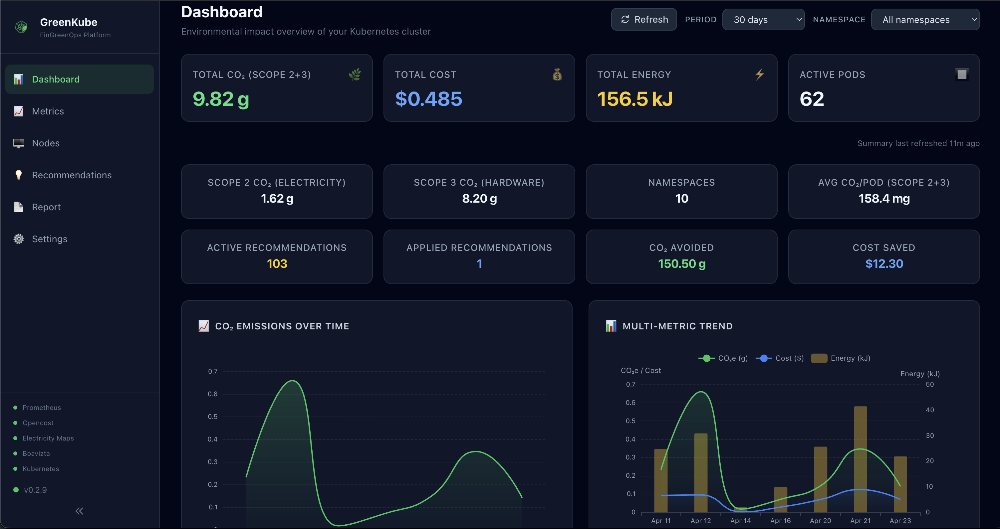
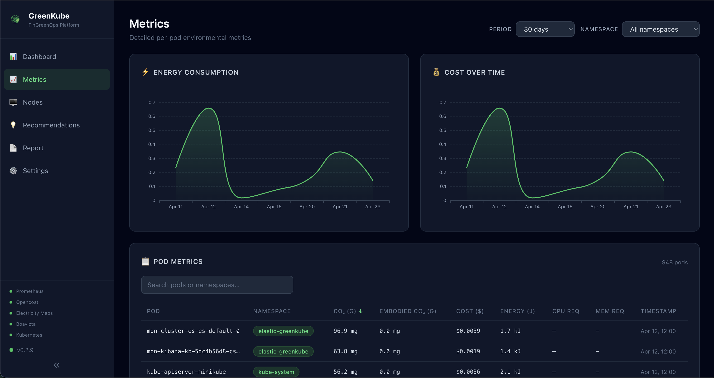
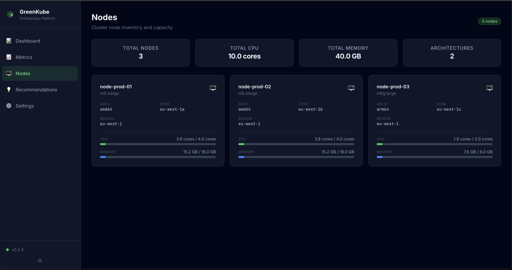
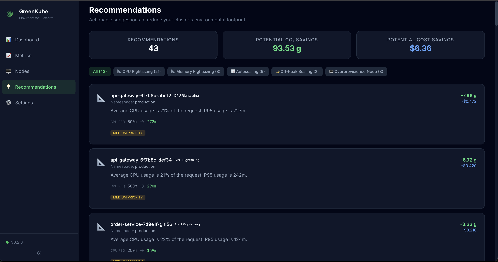
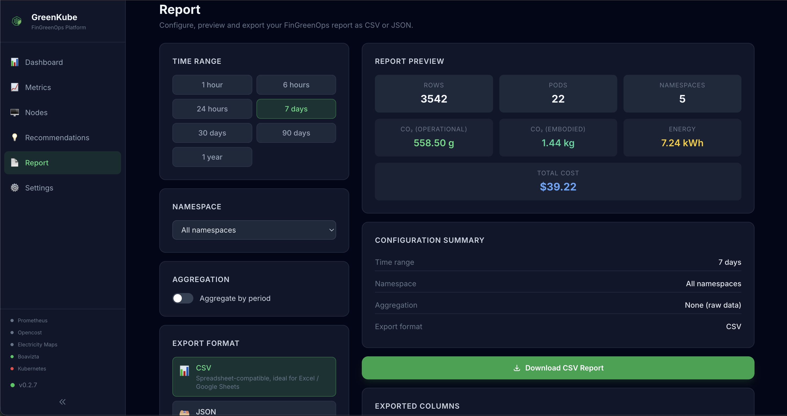
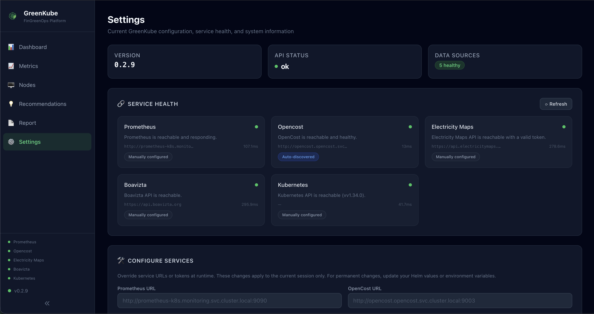

# GreenKube

**Measure, understand, and reduce the carbon footprint of your Kubernetes infrastructure.**

GreenKube is an open-source FinGreenOps platform for Kubernetes. It gives DevOps, SRE, and FinOps teams workload-level carbon visibility and cost control — without complex setup or expensive SaaS tooling.

[](https://opensource.org/licenses/Apache-2.0) [](https://hub.docker.com/r/greenkube/greenkube) [](CHANGELOG.md)

>**Live demo:** [demo.greenkube.cloud](https://demo.greenkube.cloud) — explore the full dashboard with realistic sample data, no install required.

---

## What it does

- **Estimates** the energy consumption and CO₂e emissions of each Kubernetes workload, using CPU metrics from Prometheus and cloud instance power profiles.
- **Visualises** those metrics in a web dashboard with per-pod data, node inventory, and namespace breakdowns.
- **Recommends** concrete optimizations to simultaneously reduce cloud spend and carbon footprint — rightsizing, zombie pod cleanup, autoscaling candidates, and more.
- **Reports** historical estimated emissions and cost data, exportable as CSV or JSON for further analysis.
- **Integrates** with Prometheus and Grafana to expose GreenKube metrics alongside the rest of your cluster observability stack.

---

## Screenshots

| Grafana dashboard |
|------------------|
|  |

### Frontend screenshots 

| Dashboard | Metrics |
|----------|----------|
|  |  |

| Nodes | Recommendations |
|----------|----------|
|  |  |

| Report | Settings |
|----------|----------|
|  |  |

---

## Documentation

| Document | Description |
|----------|-------------|
| [Architecture](docs/architecture.md) | Technical architecture, data flow, and component breakdown |
| [Power estimation methodology](docs/power_estimation_methodology.md) | How energy and CO₂e are calculated |
| [Configuration](docs/configuration.md) | All Helm values and environment variables |
| [API Reference](docs/api.md) | REST API endpoints, parameters, and examples |
| [CLI Reference](docs/cli.md) | `greenkube start`, `demo`, and other CLI commands |
| [Recommendation lifecycle](docs/recommendation.md) | How recommendations are generated, persisted, actioned, and measured |
| [Optimization engine specification](docs/specs/optimization-engine.md) | Technical specification: multi-source engine, evidence model, ranking, verification |
| [Prometheus & Grafana](docs/prometheus-grafana.md) | ServiceMonitor setup and Grafana dashboard import |
| [Sustainability score](docs/sustainability-score.md) | How the 0–100 composite score is computed |
| [Changelog](CHANGELOG.md) | Version history |

---

Published dashboard on Grafana.com: https://grafana.com/grafana/dashboards/25377-greenkube-fingreenops-dashboard/

## Installation

The recommended deployment method is the official Helm chart.

```bash
helm repo add greenkube https://GreenKubeCloud.github.io/GreenKube
helm repo update
helm install greenkube greenkube/greenkube \
  -n greenkube \
  --create-namespace
```

The chart defaults to the `standalone` profile and development configuration. An empty API key leaves protected API routes open, so configure authentication and network controls before exposing an installation. See the [configuration reference](docs/configuration.md#api-authentication-and-runtime-service-settings) for production settings and the `production` profile. Git pull-request operations also require the automation worker, which is rendered by the `production` profile; the standalone profile only queues operations.

Once deployed, access the dashboard:

```bash
kubectl port-forward svc/greenkube-api 8000:8000 -n greenkube
# Open http://localhost:8000
```

### Key configuration variables

Create a `my-values.yaml` to customise your deployment:

```yaml
secrets:
  # Electricity Maps API token for real-time grid carbon intensity.
  # Free token: https://www.electricitymaps.com/
  electricityMapsToken: ""

config:
  prometheus:
    url: ""              # Leave empty for automatic in-cluster discovery
    queryRangeStep: 5m   # Prometheus query-range step
```

Apply it:

```bash
helm upgrade greenkube greenkube/greenkube \
  -n greenkube \
  -f my-values.yaml
```

For the full list of available variables, see the [Configuration reference](docs/configuration.md).

### Dependencies

GreenKube auto-discovers the following services. No manual configuration is required in most cases.

| Service | Purpose | Required? |
|---------|---------|-----------|
| Prometheus | CPU, memory, network, disk metrics | Strongly recommended |
| OpenCost | Cost allocation data | Optional |

### On-premises clusters

Cloud providers expose zone labels on nodes automatically. On bare-metal clusters, label your nodes manually:

```bash
kubectl label nodes --all topology.kubernetes.io/zone=FR
```

Then set `config.cloudProvider: on-prem` and `config.defaultZone: FR` in your values. See the [Configuration reference](docs/configuration.md#on-premises-and-bare-metal-clusters) for details.

---

## Try the demo locally

```bash
docker run --rm -p 9000:9000 greenkube/greenkube demo --no-browser --port 9000
# Open http://localhost:9000
```

The demo includes a two-year sample history, with hourly workload metrics in the recent window selected by `--days` (30 days by default) and daily metric and carbon-intensity points further back. It includes estimated emissions, costs, node history, and optimization recommendations.

---

## Contributing

Contributions are welcome. See [CONTRIBUTING.md](CONTRIBUTING.md) to get started.

```bash
git clone https://github.com/GreenKubeCloud/GreenKube.git
cd GreenKube
uv sync
pytest
```

---

## Licence

Licensed under the [Apache 2.0 License](LICENSE).
