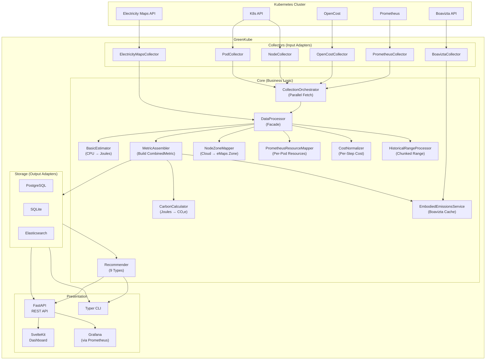

# GreenKube Architecture

This document describes the technical architecture of GreenKube. The goal is to create a lightweight, modular, and extensible platform to measure, report, and optimize the carbon footprint and cost of Kubernetes workloads.

## Architecture Diagram



## Overview

GreenKube operates as an **asynchronous** agent that collects, processes, analyzes, and reports data. It runs as both a scheduled service (continuous monitoring) and an on-demand CLI tool (ad-hoc reporting). 

The system is designed around the principles of **Clean Architecture** and **Hexagonal Architecture**:
- **Core Business Logic** (domain layer) is independent of infrastructure
- **Adapters** (collectors, repositories) interface with external systems
- **Use Cases** (processor, calculator, recommender) orchestrate business logic
- **Presentation Layer** (API, CLI, Dashboard) provides multiple interfaces

All I/O operations use Python's `asyncio` for high-performance, non-blocking concurrent execution.

## Architectural Principles

### 1. Database Agnosticism
The core business logic (`src/greenkube/core`) **NEVER** depends on a specific storage implementation. This is enforced through:
- **Repository Pattern:** Abstract base classes define interfaces (`CarbonIntensityRepository`, `NodeRepository`)
- **Factory Pattern:** `src/greenkube/core/factory.py` instantiates the appropriate repository based on configuration
- **Dependency Injection:** Repositories are injected into use cases (Processor, Calculator)

Supported backends:
- **PostgreSQL** (production): Full SQL features, transactional integrity, robust migrations
- **SQLite** (development): Lightweight, file-based, perfect for local testing
- **Elasticsearch** (scale): Time-series optimized, distributed, advanced analytics

### 2. Cloud Provider Agnosticism
Cloud-specific details (AWS, GCP, Azure, OVH, Scaleway) are isolated in:
- **Mapping files:** `src/greenkube/utils/region_mapping.py` (cloud region → carbon zone)
- **Instance profiles:** `src/greenkube/energy/instance_profiles.py` (instance type → power characteristics)
- **Adapters:** Cloud-specific logic stays in collectors, never leaks into core

### 3. Asynchronous & Non-Blocking
- **All I/O is async:** Network requests, database queries, file operations
- **Concurrent execution:** `asyncio.gather` for parallel data collection
- **Connection pooling:** Reusable HTTP clients and DB connection pools
- **Backpressure handling:** Controlled concurrency limits to prevent resource exhaustion

## Core Components

### Collectors (Input Ports)
All collectors are fully asynchronous and implement a common pattern.

#### **PrometheusCollector**
- **Purpose:** Fetch resource usage metrics from Prometheus
- **Metrics collected:**
  - CPU usage (cores) per pod/container
  - Memory usage (bytes) per pod
  - Network I/O (bytes received/transmitted) per pod
  - Disk I/O (bytes read/written) per pod
  - Pod restart counts
  - Node instance type labels
- **Features:**
  - Auto-discovery of Prometheus endpoints (multiple URL candidates)
  - Fallback queries when container-level metrics unavailable
  - TLS/authentication support (basic auth, bearer token)
  - Concurrent query execution (8 queries via `asyncio.gather`)
  - Robust error handling with detailed logging
- **Implementation:** Uses `httpx.AsyncClient` for non-blocking HTTP requests
- **Emits:** `PrometheusMetric` (aggregated result with all metric lists)

#### **NodeCollector**
- **Purpose:** Gather node metadata from Kubernetes API
- **Data collected:**
  - Node capacity (CPU cores, memory bytes)
  - Cloud provider and instance type (from labels)
  - Availability zone
  - Architecture (amd64, arm64)
  - Operating system
- **Implementation:** Uses `kubernetes_asyncio` client for async K8s API calls
- **Emits:** `Dict[str, NodeInfo]` (node name → metadata)

#### **PodCollector**
- **Purpose:** Collect pod resource requests from Kubernetes
- **Data collected:**
  - CPU requests (millicores)
  - Memory requests (bytes)
  - Ephemeral storage requests (bytes)
  - Owner references (Deployment, StatefulSet, etc.)
- **Implementation:** Async K8s API with label-based filtering
- **Emits:** `List[PodMetric]`

#### **OpenCostCollector** (optional)
- **Purpose:** Fetch cost allocation data
- **Features:** Auto-discovery, multiple endpoint probing
- **Implementation:** Async HTTP with JSON parsing
- **Emits:** `List[CostMetric]`

#### **ElectricityMapsCollector**
- **Purpose:** Retrieve real-time carbon intensity data
- **API:** Electricity Maps v3 API
- **Caching:** Stores results in repository for future queries
- **Implementation:** Async HTTP with error handling (graceful degradation to default intensity)

#### **BoaviztaCollector**
- **Purpose:** Fetch hardware embodied emissions data
- **API:** Boavizta API
- **Caching:** Stores server impact profiles in `EmbodiedRepository`
- **Emits:** Server impact data (GWP manufacture, lifespan)

### Estimator (Business Logic)

#### **BasicEstimator**
- **Purpose:** Convert resource usage metrics into energy consumption
- **Input:** `PrometheusMetric` (CPU usage rates per pod)
- **Process:**
  1. Retrieve instance power profile for each node
  2. Calculate dynamic power based on CPU utilization
  3. Add idle power component
  4. Distribute energy across pods proportionally
- **Fallback:** Uses `DEFAULT_INSTANCE_PROFILE` when node type unknown
- **Output:** `List[EnergyMetric]` (Joules per pod)

### Processor (Use Case Orchestrator)

#### **DataProcessor**
The main orchestrator that coordinates the data pipeline from collection to metric assembly.

**Architecture:** The processor acts as a facade, delegating specialized work to focused collaborators while managing the overall pipeline flow.

**Key Responsibilities:**
1. **Data Collection:** Coordinates parallel collection from Prometheus, Kubernetes, OpenCost, and external APIs
2. **Energy Estimation:** Converts resource usage into energy consumption (Joules)
3. **Zone Mapping:** Resolves cloud regions to carbon intensity zones
4. **Carbon Calculation:** Computes CO2e emissions from energy and grid intensity
5. **Metric Assembly:** Combines energy, cost, resources, and metadata into unified metrics
6. **Embodied Emissions:** Integrates hardware manufacturing emissions

**Pipeline Stages:**
- **Instant Mode (`run()`):** Real-time collection using Prometheus instant queries
- **Range Mode (`run_range()`):** Historical analysis with day-sized chunking for memory efficiency

**Implementation Pattern:** 
- Follows Clean Architecture principles with dependency injection
- Uses internal collaborators for collection orchestration, zone mapping, resource aggregation, and metric assembly
- Maintains separation between business logic and infrastructure concerns

### Calculator (Business Logic)

#### **CarbonCalculator**
- **Purpose:** Convert energy to carbon emissions
- **Formula:** `CO2e = (kWh * grid_intensity * PUE) / 1000`
- **Features:**
  - Per-run in-memory cache: `(zone, timestamp) → intensity`
  - Supports both 'Z' and '+00:00' ISO timestamp formats
  - Normalization-aware (hour/day/none)
  - Async cache lookups with fallback to default intensity
- **Output:** `CarbonResult` (CO2e grams, grid intensity, timestamp)

### Recommender (Business Logic)

#### **Recommender / RecommenderV2**
Analyzes `CombinedMetric` data to identify optimization opportunities.

**Recommendation Types:**
1. **Zombie Pods:** Workloads consuming resources but producing minimal value
   - Criteria: Low CPU/energy, high cost, extended idle time
   - Savings: Potential cost and emission reduction

2. **Rightsizing:**
   - Over-provisioned CPU: Request >> actual usage
   - Over-provisioned memory: Request >> actual usage
   - Headroom calculation for safe downsizing
   - Savings estimate based on cloud provider pricing

3. **Autoscaling Candidates:**
   - High coefficient of variation (CV) in usage
   - Spike detection (max/avg ratio)
   - HPA/VPA recommendations

4. **Carbon-Aware Scheduling:**
   - Identifies high-carbon-intensity periods
   - Suggests workload time-shifting for batch jobs

5. **Idle Namespace Cleanup:**
   - Namespaces with minimal activity
   - Low-value resource consumption

**Configuration:** All thresholds configurable via `config.py` and Helm values

### Repositories (Output Ports)
Repositories use asynchronous drivers for high-performance database interactions. All implement abstract base classes to ensure database agnosticism.

#### **CarbonIntensityRepository**
Abstract base class for carbon intensity storage.

Implementations:
- **PostgresCarbonIntensityRepository** (Default/Production):
  - Driver: `asyncpg` (native async PostgreSQL)
  - Features: Connection pooling, prepared statements, transactional DDL
  - Schema: `carbon_intensity` table with zone, timestamp, intensity
  - Migrations: Automatic schema creation and updates

- **SQLiteCarbonIntensityRepository** (Development/Testing):
  - Driver: `aiosqlite` (async SQLite wrapper)
  - Features: File-based, zero-config, perfect for CI/CD
  - Schema: Same as PostgreSQL for compatibility
  - Migrations: ALTER TABLE with existence checks

- **ElasticsearchCarbonIntensityRepository** (Scale/Analytics):
  - Driver: `elasticsearch` (async client)
  - Features: Time-series optimized, distributed, searchable
  - Index: `carbon_intensity` with date-based partitioning
  - Queries: DSL-based with aggregations support

#### **NodeRepository**
Abstract base class for node state snapshots.

Implementations:
- **PostgresNodeRepository:**
  - Schema: `node_snapshots` table with timestamp, name, instance_type, zone, capacity
  - Features: Historical timeline reconstruction, TTL-based cleanup
  - Queries: Latest snapshots before timestamp, snapshot ranges

- **SQLiteNodeRepository:**
  - Same schema and features as PostgreSQL
  - Lightweight for single-node deployments

- **ElasticsearchNodeRepository:**
  - Document-based node snapshots
  - Time-series queries with aggregations

#### **CombinedMetricRepository**
Stores final aggregated metrics (energy + carbon + cost + resources).

Schema (33 columns):
- Core: pod_name, namespace, timestamp, duration_seconds
- Energy: joules, co2e_grams, grid_intensity, pue
- Cost: total_cost
- Resources:
  - CPU: cpu_request, cpu_usage_millicores
  - Memory: memory_request, memory_usage_bytes
  - Network: network_receive_bytes, network_transmit_bytes
  - Disk: disk_read_bytes, disk_write_bytes
  - Storage: storage_request_bytes, storage_usage_bytes, ephemeral_storage_request_bytes, ephemeral_storage_usage_bytes
  - GPU: gpu_usage_millicores
  - Restarts: restart_count
- Metadata: node, node_instance_type, node_zone, emaps_zone, owner_kind, owner_name
- Estimation: is_estimated, estimation_reasons, embodied_co2e_grams

Migrations: All backends support automatic schema evolution (ADD COLUMN IF NOT EXISTS)

#### **EmbodiedRepository**
Caches Boavizta API responses for hardware embodied emissions.

Schema: provider, instance_type, gwp_manufacture, lifespan_hours, last_updated

### API & Presentation Layer

#### **FastAPI Server**
- **Location:** `src/greenkube/api/`
- **Port:** 8000 (configurable)
- **Features:**
  - OpenAPI/Swagger documentation at `/api/v1/docs`
  - CORS support for frontend
  - Health checks and readiness probes
  - Structured logging with request IDs
  - Error handling with appropriate HTTP status codes

**Endpoints:**
- `GET /api/v1/health` — Health check and version
- `GET /api/v1/config` — Current configuration (sanitized secrets)
- `GET /api/v1/metrics` — Per-pod metrics with filtering
- `GET /api/v1/metrics/summary` — Aggregated totals
- `GET /api/v1/metrics/timeseries` — Time-series data with granularity
- `GET /api/v1/namespaces` — Active namespaces list
- `GET /api/v1/nodes` — Node inventory
- `GET /api/v1/recommendations` — Optimization suggestions
- `GET /api/v1/report/summary` — Report preview (row count, totals, unique pods/namespaces)
- `GET /api/v1/report/export` — Stream a report file (CSV or JSON) for direct browser download

**Report export query parameters:**
- `format` — `csv` (default) or `json`
- `last` — time range string (`1h`, `24h`, `7d`, `30d`, `1y`, etc.)
- `namespace` — filter to a single namespace
- `aggregate` — `true` to aggregate by (namespace, pod, period)
- `granularity` — grouping when aggregate=true: `hourly`, `daily`, `weekly`, `monthly`, `yearly`

#### **SvelteKit Dashboard**
- **Location:** `frontend/`
- **Framework:** SvelteKit (SSR + SPA)
- **Build:** Vite with adapter-static
- **Styling:** Tailwind CSS
- **Charts:** ECharts for interactive visualizations
- **Deployment:** Static build served by FastAPI at `/`

**Pages:**
- `/` — Dashboard (KPIs, charts, breakdown)
- `/metrics` — Interactive metrics table
- `/nodes` — Node inventory
- `/recommendations` — Optimization recommendations
- `/report` — Report builder: choose time range, namespace, aggregation, format and download CSV/JSON
- `/settings` — Configuration and system info

**Features:**
- Client-side routing for smooth navigation
- Responsive design (mobile-first)
- Real-time data updates (polling)
- Export functionality (CSV, JSON) — both from the Report page and via the CLI
- Theme support (light/dark)

#### **CLI**
- **Location:** `src/greenkube/cli/`
- **Framework:** Typer with Rich for formatting
- **Commands:**
  - `greenkube report` — Generate reports with filtering
  - `greenkube recommend` — Get optimization recommendations
  - `greenkube start` — Run as background service
  - `greenkube api` — Start API server
  - `greenkube demo` — Launch demo mode with sample data
  - `greenkube version` — Show version info

#### **Grafana Integration**
- **Dashboard:** `dashboards/greenkube-grafana.json`
- **Data source:** Prometheus scraping `/prometheus/metrics`
- **Helm resources:** `ServiceMonitor`, `NetworkPolicy`, Prometheus RBAC
- **Panels:** KPIs, time-series (CO₂e, cost, energy), namespace breakdown, top pods, node utilization, grid intensity, recommendations

## Data Flow

### Instant Collection (run())
Used for real-time monitoring and scheduled collection.

1. **Parallel Collection Phase** (asyncio.gather):
   ```
   ┌─ PrometheusCollector.collect()
   │   ├─ CPU usage (8 concurrent queries)
   │   ├─ Memory usage
   │   ├─ Network I/O (rx + tx)
   │   ├─ Disk I/O (read + write)
   │   ├─ Restart counts
   │   └─ Node labels
   ├─ NodeCollector.collect()
   │   └─ Node metadata (instance type, zone, capacity)
   ├─ PodCollector.collect()
   │   └─ Resource requests (CPU, memory, storage)
   └─ OpenCostCollector.collect()
       └─ Cost allocation data
   ```

2. **Aggregation Phase:**
   ```
   Build per-pod maps:
   - CPU usage (actual)
   - Memory usage (actual)
   - Network rx/tx (bytes)
   - Disk read/write (bytes)
   - Restart count
   - CPU/memory/storage requests
   ```

3. **Energy Estimation:**
   ```
   BasicEstimator.calculate_node_energy()
   ├─ Get instance power profile
   ├─ Calculate dynamic power (CPU-based)
   ├─ Add idle power
   └─ Distribute to pods → EnergyMetric (Joules)
   ```

4. **Zone Mapping & Intensity Prefetch:**
   ```
   DataProcessor._get_node_emaps_map()
   ├─ Map cloud region → carbon zone
   ├─ Group pods by zone
   └─ Prefetch intensity data for (zone, timestamp) tuples
       ├─ Check cache
       ├─ Query repository
       └─ Fallback to Electricity Maps API
   ```

5. **Carbon Calculation:**
   ```
   CarbonCalculator.calculate_emissions()
   ├─ Convert Joules → kWh
   ├─ Lookup intensity from cache
   ├─ Apply PUE factor
   └─ Calculate CO2e grams
   ```

6. **CombinedMetric Assembly:**
   ```
   Merge all data sources:
   ├─ Energy (Joules, CO2e)
   ├─ Cost (total_cost)
   ├─ Resources (CPU, mem, net, disk, storage, restarts)
   ├─ Metadata (node, zone, instance type)
   └─ Estimation flags/reasons
   ```

7. **Persistence:**
   ```
   Repository.write_combined_metrics()
   └─ Batch insert to database (Postgres/SQLite/ES)
   ```

### Historical Analysis (run_range())
Used for reporting over time ranges with historical accuracy.

1. **Historical Node State Loading:**
   ```
   NodeRepository.get_latest_snapshots_before(start)
   NodeRepository.get_snapshots(start, end)
   └─ Reconstruct node timeline
   ```

2. **Chunked Processing** (day-sized chunks to prevent OOM):
   ```
   For each chunk (1 day):
     ├─ Prometheus range queries (concurrent):
     │   ├─ CPU usage over time
     │   ├─ Network I/O over time
     │   ├─ Disk I/O over time
     │   ├─ Restart counts over time
     │   └─ (5 queries via asyncio.gather)
     │
     ├─ Parse time-series data:
     │   └─ Build per-pod resource maps from range results
     │
     ├─ Energy estimation per timestamp:
     │   └─ Use historical node profile at each timestamp
     │
     ├─ Carbon calculation:
     │   └─ Historical intensity lookup
     │
     └─ Generate CombinedMetrics for chunk
   ```

3. **Aggregation:**
   ```
   Collect all chunks → Filter by namespace → Return
   ```

### Recommendation Flow

1. **Data Collection:**
   ```
   Read CombinedMetrics from repository (last N days)
   ```

2. **Analysis:**
   ```
   RecommenderV2.generate_recommendations()
   ├─ Aggregate by pod/namespace
   ├─ Calculate statistics (mean, max, CV)
   ├─ Apply thresholds:
   │   ├─ Zombie detection
   │   ├─ Rightsizing analysis
   │   ├─ Autoscaling candidates
   │   └─ Carbon-aware opportunities
   └─ Calculate savings (cost + CO2e)
   ```

3. **Output:**
   ```
   Return List[Recommendation] with:
   ├─ Type and severity
   ├─ Affected resources
   ├─ Current vs. recommended
   ├─ Estimated savings
   └─ Actionable commands
   ```

## Configuration & Deployment

### Environment Variables (12-Factor App)
All configuration flows through `src/greenkube/core/config.py`:

**Database:**
- `DB_TYPE` — postgres|sqlite|elasticsearch
- `DB_CONNECTION_STRING` — PostgreSQL connection URL
- `DB_PATH` — SQLite file path
- `ELASTICSEARCH_HOSTS` — ES cluster endpoints

**External Services:**
- `PROMETHEUS_URL` — Override auto-discovery
- `OPENCOST_URL` — Override auto-discovery
- `ELECTRICITYMAPS_TOKEN` — API token (optional)
- `BOAVIZTA_TOKEN` — API token (optional)

**Collection:**
- `PROMETHEUS_QUERY_RANGE_STEP` — Default: 5m
- `NODE_ANALYSIS_INTERVAL` — Default: 5m
- `NODE_DATA_MAX_AGE_DAYS` — Default: 30

**Carbon:**
- `DEFAULT_ZONE` — Fallback carbon zone
- `DEFAULT_INTENSITY` — Fallback intensity (gCO2e/kWh)
- `NORMALIZATION_GRANULARITY` — hour|day|none

**Recommendations:**
- `RECOMMENDATION_LOOKBACK_DAYS` — Default: 7
- `RIGHTSIZING_CPU_THRESHOLD` — Default: 0.3
- `ZOMBIE_COST_THRESHOLD` — Default: 0.01
- And ~10 more recommendation tuning parameters

### Helm Chart Structure
```
helm-chart/
├── Chart.yaml              # Chart metadata
├── values.yaml             # Default configuration
└── templates/
    ├── deployment.yaml     # GreenKube deployment
    ├── service.yaml        # API service (LoadBalancer/ClusterIP)
    ├── configmap.yaml      # Non-secret config
    ├── secret.yaml         # Tokens and credentials
    ├── postgres-*.yaml     # PostgreSQL StatefulSet (optional)
    ├── serviceaccount.yaml # K8s RBAC
    ├── clusterrole.yaml    # Read permissions for nodes/pods
    └── post-install-hook.yaml  # Schema initialization
```

### Container Structure (Multi-Stage Build)
```
Dockerfile (3 stages):
1. Frontend Builder (Node 20):
   ├─ npm ci (install deps)
   ├─ npm run build (SvelteKit SSG)
   └─ Output: static files in build/

2. Python Builder (Python 3.14):
   ├─ pip install build
   ├─ Build wheel from pyproject.toml
   └─ pip install to /install prefix

3. Final Image (Python 3.14-slim):
   ├─ Copy Python packages from builder
   ├─ Copy frontend build from frontend-builder
   ├─ Run as non-root user 'greenkube'
   └─ ENTRYPOINT: greenkube CLI
```

## Normalization and Caching

### Timestamp Normalization
Controlled by `NORMALIZATION_GRANULARITY`:

- **'hour'** (default): Round down to start of hour
  - `2024-02-21T14:37:22Z` → `2024-02-21T14:00:00Z`
  - Reduces API calls, good for most use cases

- **'day'**: Round down to midnight UTC
  - `2024-02-21T14:37:22Z` → `2024-02-21T00:00:00Z`
  - Lowest API usage, less granular

- **'none'**: Use exact timestamp
  - High API usage, maximum granularity

### Caching Strategy

**CarbonCalculator Cache:**
- Type: In-memory dict
- Scope: Per-run (cleared after each collection cycle)
- Key: `(zone, normalized_timestamp_iso)`
- Variants: Both 'Z' and '+00:00' suffixes stored
- Purpose: Avoid redundant intensity lookups within same run

**Repository Cache:**
- Type: Persistent database
- Scope: Historical data (TTL-based cleanup)
- Key: (zone, timestamp)
- Purpose: Avoid repeated API calls across runs

**Boavizta Cache:**
- Type: Persistent database (`EmbodiedRepository`)
- Scope: Long-term (instance profiles rarely change)
- Key: (provider, instance_type)
- Purpose: Minimize external API calls for embodied emissions

## Performance Considerations

### Concurrency
- **Collectors:** All run concurrently via `asyncio.gather`
- **Prometheus Queries:** 8 queries in parallel (CPU, mem, net rx/tx, disk r/w, restarts, nodes)
- **Database Operations:** Connection pooling, batch inserts
- **Historical Processing:** Day-sized chunks with explicit memory cleanup

### Memory Management
- **Chunking:** `run_range()` processes 1 day at a time
- **Explicit Cleanup:** `del` statements for large intermediate structures
- **Streaming:** Database cursors for large result sets

### Scalability
- **PostgreSQL:** Handles 100K+ metrics/day with proper indexing
- **Elasticsearch:** Designed for millions of metrics with sharding
- **API:** FastAPI with async workers (Uvicorn)

## Testing Strategy

### Unit Tests
- **Coverage:** 293 tests across all components
- **Framework:** pytest with pytest-asyncio
- **Mocking:** unittest.mock.AsyncMock for async components
- **Fixtures:** Shared test data in conftest.py

### Integration Tests
- **Database:** All repositories tested against real DB instances
- **API:** Full request/response cycle tests
- **Collectors:** Mocked HTTP responses with respx

### Test Patterns
- **TDD:** Write tests before implementation
- **AAA:** Arrange, Act, Assert structure
- **Async:** All async code tested with pytest.mark.asyncio
- **Isolation:** No shared state between tests

## Design Principles & Guidelines

### For Contributors

#### Database Agnosticism (Critical)
- **NEVER** import storage-specific code in `src/greenkube/core`
- **ALWAYS** use repository abstracts (defined in `storage/base_repository.py`)
- **ALWAYS** instantiate repositories via factory pattern
- Cloud-specific logic belongs in `utils/` or `energy/` mapping files

#### Error Handling
- **NEVER** let collection errors crash the pipeline
- **ALWAYS** log errors with context
- **ALWAYS** use default values or skip metrics on failure
- Use standard logger: `logging.getLogger(__name__)`

#### Async Best Practices
- **ALWAYS** use `async def` for I/O operations
- **ALWAYS** await async calls (no sync wrappers)
- **PREFER** `asyncio.gather` for concurrent operations
- **USE** connection pooling for HTTP and DB

#### Code Quality
- **RUN** `ruff format` before commits (pre-commit hook)
- **RUN** `ruff check --fix` to auto-fix issues
- **RUN** pytest before pushing (all tests must pass)
- **WRITE** tests for new features (TDD approach)
- **UPDATE** documentation when architecture changes

#### Logging Levels
- **DEBUG:** Detailed flow (cache hits, parsing details)
- **INFO:** Major pipeline events (collection start/end, metrics saved)
- **WARNING:** Recoverable issues (fallback to defaults, retries)
- **ERROR:** Failures requiring attention (API errors, DB connection issues)

#### Commit Messages
Follow conventional commits:
- `feat:` — New feature
- `fix:` — Bug fix
- `docs:` — Documentation only
- `test:` — Test additions/changes
- `refactor:` — Code restructuring
- `perf:` — Performance improvements

## Future Architecture Evolution

### Planned Enhancements

**Multi-Cluster Support:**
- Federated data collection
- Cross-cluster aggregation
- Unified dashboard view

**Advanced Analytics:**
- Trend detection and forecasting
- Anomaly detection
- Cost optimization AI/ML

**Real-Time Streaming:**
- WebSocket-based live updates
- Event-driven collection
- Real-time recommendation updates

**Extended Metrics:**
- GPU power consumption (NVIDIA DCGM)
- Storage I/O per PVC
- Network traffic per service
- Custom metrics via PromQL

**Enhanced Reporting:**
- CSRD/ESRS E1 compliant templates
- Multi-tenant isolation
- PDF/Excel export

### Extension Points

**New Collectors:**
1. Implement collector interface
2. Add to `core/factory.py`
3. Update `DataProcessor` to use it
4. Add tests

**New Storage Backend:**
1. Implement `CarbonIntensityRepository` abstract
2. Add to `core/factory.py` mapping
3. Add schema migration logic
4. Add tests

**New Cloud Provider:**
1. Add region mappings to `utils/region_mapping.py`
2. Add instance profiles to `energy/instance_profiles.py`
3. Add PUE values to `core/config.py`
4. Update tests

## Resources

- **GitHub:** https://github.com/GreenKubeCloud/GreenKube
- **Documentation:** https://greenkubecloud.github.io/GreenKube
- **Helm Chart:** https://greenkubecloud.github.io/GreenKube
- **Issues:** https://github.com/GreenKubeCloud/GreenKube/issues
- **Discussions:** https://github.com/GreenKubeCloud/GreenKube/discussions

## License

Apache 2.0 - See LICENSE file for details.